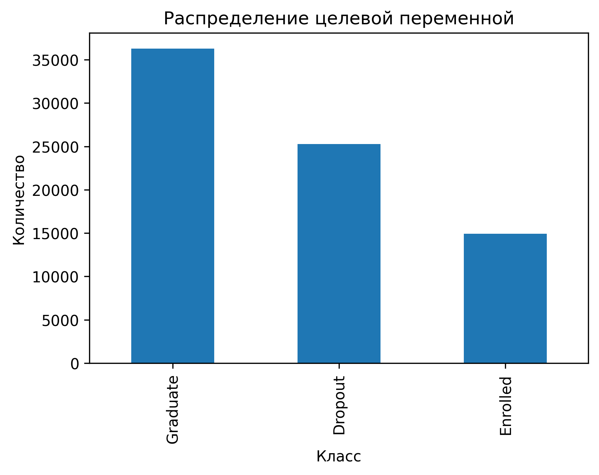
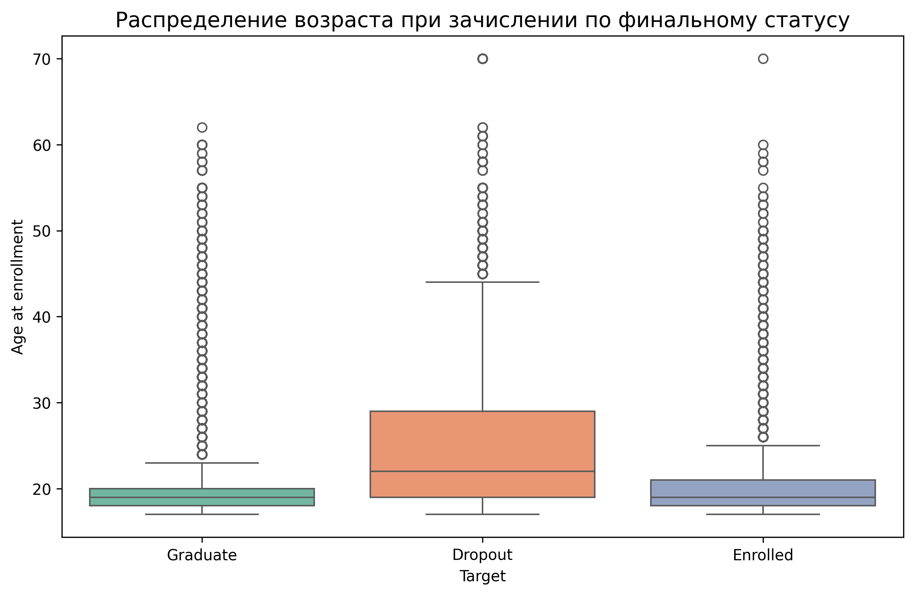
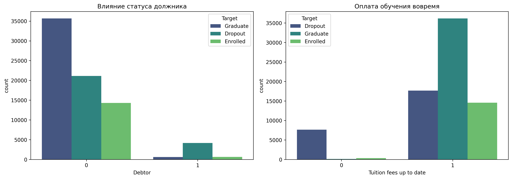
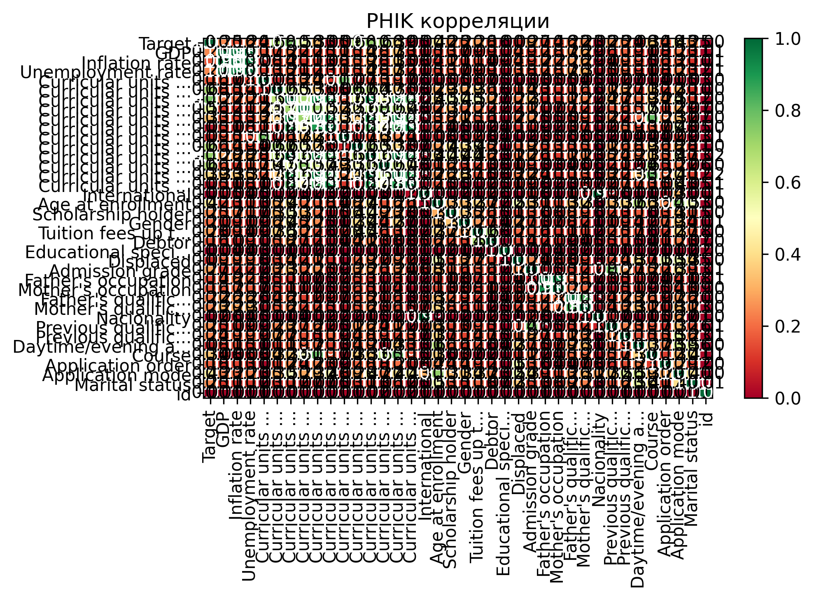
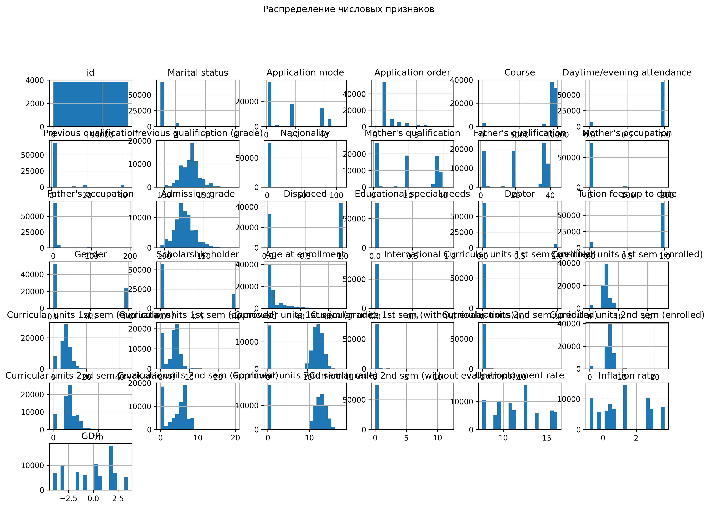
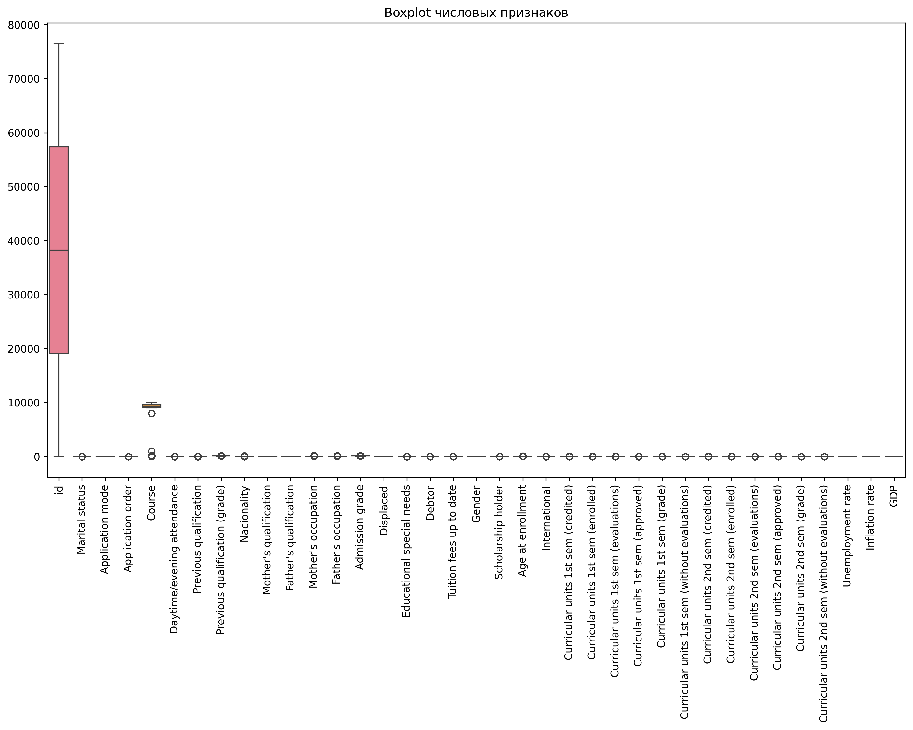
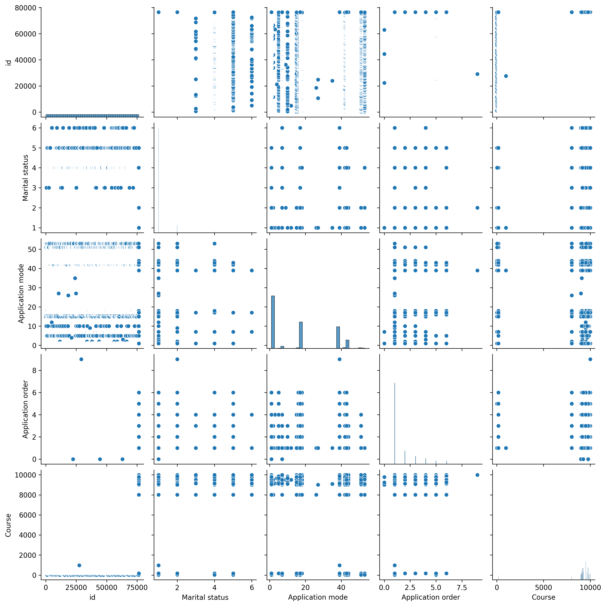
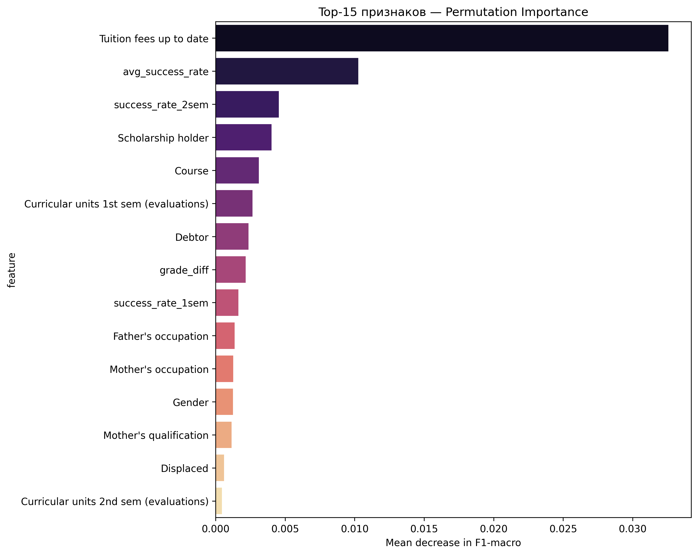

# Прогнозирование отсева студентов (Graduate / Dropout / Enrolled)

**Задача:** многоклассовая классификация (3 класса)  
**Данные:** 76 518 студентов, 37 исходных признаков  
**Метрика:** F1-macro  
**Лучший результат:** **0.796+ на 5-fold CV** (Optuna + CatBoost)

---

## 1. Исследовательский анализ данных (EDA)

Ниже проведён полный EDA с визуализацией, проверкой гипотез и созданием новых признаков.



Распределение целевой переменной: Graduate 47.4%, Dropout 33.1%, Enrolled 19.5% → дисбаланс → выбрана метрика F1-macro.



Студенты-Dropout в среднем старше 30 лет → возраст — важный фактор.



Наличие долга (Debtor=1) и неоплата обучения (Tuition fees up to date=0) — сильнейшие предикторы отсева.




Матрица корреляций PHIK.





Гистограммы и выбросы числовых признаков

### Создано 5 новых признаков (Все вошли в топ-5 по важности):

- **success_rate_1sem**, **success_rate_2sem**
- **avg_success_rate** — средний процент зачётов
- **total_approved** — общее количество сданных предметов
- **grade_diff** — разница оценок между семестрами

### **КОНСОЛЬНЫЙ ВЫВОД ИЗ EDA СКРИПТА**

````

C:\Users\user\PycharmProjects\PythonProject\.venv\Scripts\python.exe C:\Users\user\PycharmProjects\PythonProject\eda.py 
=== TRAIN HEAD ===
   id  Marital status  Application mode  ...  Inflation rate   GDP    Target
0   0               1                 1  ...             0.6  2.02  Graduate
1   1               1                17  ...             0.6  2.02   Dropout
2   2               1                17  ...             0.3 -0.92   Dropout
3   3               1                 1  ...             0.6  2.02  Enrolled
4   4               1                 1  ...             2.6  0.32  Graduate

[5 rows x 38 columns]

=== TEST HEAD ===
      id  Marital status  ...  Inflation rate   GDP
0  76518               1  ...            -0.3  0.79
1  76519               1  ...             0.6  2.02
2  76520               1  ...             2.8 -4.06
3  76521               1  ...             1.4  3.51
4  76522               1  ...             2.6  0.32

[5 rows x 37 columns]

=== TRAIN INFO ===
<class 'pandas.core.frame.DataFrame'>
RangeIndex: 76518 entries, 0 to 76517
Data columns (total 38 columns):
 #   Column                                          Non-Null Count  Dtype  
---  ------                                          --------------  -----  
 0   id                                              76518 non-null  int64  
 1   Marital status                                  76518 non-null  int64  
 2   Application mode                                76518 non-null  int64  
 3   Application order                               76518 non-null  int64  
 4   Course                                          76518 non-null  int64  
 5   Daytime/evening attendance                      76518 non-null  int64  
 6   Previous qualification                          76518 non-null  int64  
 7   Previous qualification (grade)                  76518 non-null  float64
 8   Nacionality                                     76518 non-null  int64  
 9   Mother's qualification                          76518 non-null  int64  
 10  Father's qualification                          76518 non-null  int64  
 11  Mother's occupation                             76518 non-null  int64  
 12  Father's occupation                             76518 non-null  int64  
 13  Admission grade                                 76518 non-null  float64
 14  Displaced                                       76518 non-null  int64  
 15  Educational special needs                       76518 non-null  int64  
 16  Debtor                                          76518 non-null  int64  
 17  Tuition fees up to date                         76518 non-null  int64  
 18  Gender                                          76518 non-null  int64  
 19  Scholarship holder                              76518 non-null  int64  
 20  Age at enrollment                               76518 non-null  int64  
 21  International                                   76518 non-null  int64  
 22  Curricular units 1st sem (credited)             76518 non-null  int64  
 23  Curricular units 1st sem (enrolled)             76518 non-null  int64  
 24  Curricular units 1st sem (evaluations)          76518 non-null  int64  
 25  Curricular units 1st sem (approved)             76518 non-null  int64  
 26  Curricular units 1st sem (grade)                76518 non-null  float64
 27  Curricular units 1st sem (without evaluations)  76518 non-null  int64  
 28  Curricular units 2nd sem (credited)             76518 non-null  int64  
 29  Curricular units 2nd sem (enrolled)             76518 non-null  int64  
 30  Curricular units 2nd sem (evaluations)          76518 non-null  int64  
 31  Curricular units 2nd sem (approved)             76518 non-null  int64  
 32  Curricular units 2nd sem (grade)                76518 non-null  float64
 33  Curricular units 2nd sem (without evaluations)  76518 non-null  int64  
 34  Unemployment rate                               76518 non-null  float64
 35  Inflation rate                                  76518 non-null  float64
 36  GDP                                             76518 non-null  float64
 37  Target                                          76518 non-null  object 
dtypes: float64(7), int64(30), object(1)
memory usage: 22.2+ MB

=== TEST INFO ===
<class 'pandas.core.frame.DataFrame'>
RangeIndex: 51012 entries, 0 to 51011
Data columns (total 37 columns):
 #   Column                                          Non-Null Count  Dtype  
---  ------                                          --------------  -----  
 0   id                                              51012 non-null  int64  
 1   Marital status                                  51012 non-null  int64  
 2   Application mode                                51012 non-null  int64  
 3   Application order                               51012 non-null  int64  
 4   Course                                          51012 non-null  int64  
 5   Daytime/evening attendance                      51012 non-null  int64  
 6   Previous qualification                          51012 non-null  int64  
 7   Previous qualification (grade)                  51012 non-null  float64
 8   Nacionality                                     51012 non-null  int64  
 9   Mother's qualification                          51012 non-null  int64  
 10  Father's qualification                          51012 non-null  int64  
 11  Mother's occupation                             51012 non-null  int64  
 12  Father's occupation                             51012 non-null  int64  
 13  Admission grade                                 51012 non-null  float64
 14  Displaced                                       51012 non-null  int64  
 15  Educational special needs                       51012 non-null  int64  
 16  Debtor                                          51012 non-null  int64  
 17  Tuition fees up to date                         51012 non-null  int64  
 18  Gender                                          51012 non-null  int64  
 19  Scholarship holder                              51012 non-null  int64  
 20  Age at enrollment                               51012 non-null  int64  
 21  International                                   51012 non-null  int64  
 22  Curricular units 1st sem (credited)             51012 non-null  int64  
 23  Curricular units 1st sem (enrolled)             51012 non-null  int64  
 24  Curricular units 1st sem (evaluations)          51012 non-null  int64  
 25  Curricular units 1st sem (approved)             51012 non-null  int64  
 26  Curricular units 1st sem (grade)                51012 non-null  float64
 27  Curricular units 1st sem (without evaluations)  51012 non-null  int64  
 28  Curricular units 2nd sem (credited)             51012 non-null  int64  
 29  Curricular units 2nd sem (enrolled)             51012 non-null  int64  
 30  Curricular units 2nd sem (evaluations)          51012 non-null  int64  
 31  Curricular units 2nd sem (approved)             51012 non-null  int64  
 32  Curricular units 2nd sem (grade)                51012 non-null  float64
 33  Curricular units 2nd sem (without evaluations)  51012 non-null  int64  
 34  Unemployment rate                               51012 non-null  float64
 35  Inflation rate                                  51012 non-null  float64
 36  GDP                                             51012 non-null  float64
dtypes: float64(7), int64(30)
memory usage: 14.4 MB

=== TRAIN DESCRIBE ===
                  id  Marital status  ...           GDP    Target
count   76518.000000    76518.000000  ...  76518.000000     76518
unique           NaN             NaN  ...           NaN         3
top              NaN             NaN  ...           NaN  Graduate
freq             NaN             NaN  ...           NaN     36282
mean    38258.500000        1.111934  ...     -0.080921       NaN
std     22088.988286        0.441669  ...      2.251382       NaN
min         0.000000        1.000000  ...     -4.060000       NaN
25%     19129.250000        1.000000  ...     -1.700000       NaN
50%     38258.500000        1.000000  ...      0.320000       NaN
75%     57387.750000        1.000000  ...      1.790000       NaN
max     76517.000000        6.000000  ...      3.510000       NaN

[11 rows x 38 columns]

=== TEST DESCRIBE ===
                  id  Marital status  ...  Inflation rate           GDP
count   51012.000000    51012.000000  ...    51012.000000  51012.000000
mean   102023.500000        1.109092  ...        1.228719     -0.086477
std     14726.040303        0.438084  ...        1.402773      2.251650
min     76518.000000        1.000000  ...       -0.800000     -4.060000
25%     89270.750000        1.000000  ...        0.300000     -1.700000
50%    102023.500000        1.000000  ...        1.400000      0.320000
75%    114776.250000        1.000000  ...        2.600000      1.790000
max    127529.000000        6.000000  ...        3.700000      3.510000

[8 rows x 37 columns]

=== MISSING VALUES (train) ===
id                                                0
Marital status                                    0
Application mode                                  0
Application order                                 0
Course                                            0
Daytime/evening attendance                        0
Previous qualification                            0
Previous qualification (grade)                    0
Nacionality                                       0
Mother's qualification                            0
Father's qualification                            0
Mother's occupation                               0
Father's occupation                               0
Admission grade                                   0
Displaced                                         0
Educational special needs                         0
Debtor                                            0
Tuition fees up to date                           0
Gender                                            0
Scholarship holder                                0
Age at enrollment                                 0
International                                     0
Curricular units 1st sem (credited)               0
Curricular units 1st sem (enrolled)               0
Curricular units 1st sem (evaluations)            0
Curricular units 1st sem (approved)               0
Curricular units 1st sem (grade)                  0
Curricular units 1st sem (without evaluations)    0
Curricular units 2nd sem (credited)               0
Curricular units 2nd sem (enrolled)               0
Curricular units 2nd sem (evaluations)            0
Curricular units 2nd sem (approved)               0
Curricular units 2nd sem (grade)                  0
Curricular units 2nd sem (without evaluations)    0
Unemployment rate                                 0
Inflation rate                                    0
GDP                                               0
Target                                            0
dtype: int64

=== MISSING VALUES (test) ===
id                                                0
Marital status                                    0
Application mode                                  0
Application order                                 0
Course                                            0
Daytime/evening attendance                        0
Previous qualification                            0
Previous qualification (grade)                    0
Nacionality                                       0
Mother's qualification                            0
Father's qualification                            0
Mother's occupation                               0
Father's occupation                               0
Admission grade                                   0
Displaced                                         0
Educational special needs                         0
Debtor                                            0
Tuition fees up to date                           0
Gender                                            0
Scholarship holder                                0
Age at enrollment                                 0
International                                     0
Curricular units 1st sem (credited)               0
Curricular units 1st sem (enrolled)               0
Curricular units 1st sem (evaluations)            0
Curricular units 1st sem (approved)               0
Curricular units 1st sem (grade)                  0
Curricular units 1st sem (without evaluations)    0
Curricular units 2nd sem (credited)               0
Curricular units 2nd sem (enrolled)               0
Curricular units 2nd sem (evaluations)            0
Curricular units 2nd sem (approved)               0
Curricular units 2nd sem (grade)                  0
Curricular units 2nd sem (without evaluations)    0
Unemployment rate                                 0
Inflation rate                                    0
GDP                                               0
dtype: int64

=== PHIK CORRELATION MATRIX ===
interval columns not set, guessing: ['id', 'Marital status', 'Application mode', 'Application order', 'Course', 'Daytime/evening attendance', 'Previous qualification', 'Previous qualification (grade)', 'Nacionality', "Mother's qualification", "Father's qualification", "Mother's occupation", "Father's occupation", 'Admission grade', 'Displaced', 'Educational special needs', 'Debtor', 'Tuition fees up to date', 'Gender', 'Scholarship holder', 'Age at enrollment', 'International', 'Curricular units 1st sem (credited)', 'Curricular units 1st sem (enrolled)', 'Curricular units 1st sem (evaluations)', 'Curricular units 1st sem (approved)', 'Curricular units 1st sem (grade)', 'Curricular units 1st sem (without evaluations)', 'Curricular units 2nd sem (credited)', 'Curricular units 2nd sem (enrolled)', 'Curricular units 2nd sem (evaluations)', 'Curricular units 2nd sem (approved)', 'Curricular units 2nd sem (grade)', 'Curricular units 2nd sem (without evaluations)', 'Unemployment rate', 'Inflation rate', 'GDP']

=== PHIK CORRELATION MATRIX (BIG) ===
interval columns not set, guessing: ['id', 'Marital status', 'Application mode', 'Application order', 'Course', 'Daytime/evening attendance', 'Previous qualification', 'Previous qualification (grade)', 'Nacionality', "Mother's qualification", "Father's qualification", "Mother's occupation", "Father's occupation", 'Admission grade', 'Displaced', 'Educational special needs', 'Debtor', 'Tuition fees up to date', 'Gender', 'Scholarship holder', 'Age at enrollment', 'International', 'Curricular units 1st sem (credited)', 'Curricular units 1st sem (enrolled)', 'Curricular units 1st sem (evaluations)', 'Curricular units 1st sem (approved)', 'Curricular units 1st sem (grade)', 'Curricular units 1st sem (without evaluations)', 'Curricular units 2nd sem (credited)', 'Curricular units 2nd sem (enrolled)', 'Curricular units 2nd sem (evaluations)', 'Curricular units 2nd sem (approved)', 'Curricular units 2nd sem (grade)', 'Curricular units 2nd sem (without evaluations)', 'Unemployment rate', 'Inflation rate', 'GDP']
Инсайт: студенты, которые в итоге Dropout, в среднем старше 30 лет → семейные/рабочие обстоятельства.
Инсайт: наличие долга и неоплата обучения — сильнейшие предикторы Dropout.
ANOVA для avg_success_rate: F = 72059.76, p-value = 0.00e+00
→ Гипотеза подтверждена: средний процент зачётов сильно различается между группами (p << 0.05)
Chi2 для Scholarship holder: p-value = 0.00e+00 → стипендия значимо влияет на исход

Process finished with exit code 0

````

---

## 2. Методология и валидация

* Метрика: F1-macro (обоснована дисбалансом классов)
* Схема валидации: Stratified 5-fold CV
* Зафиксирован SEED=42 везде
* Проверено отсутствие data leakage

### **КОНСОЛЬНЫЙ ВЫВОД ИЗ PIPELINE СКРИПТА**

```

C:\Users\user\PycharmProjects\PythonProject\pipeline_model.py
Категориальных признаков: 17
Числовых признаков: 19
Запуск обучения с CV...
0:	learn: 1.0424174	test: 1.0426698	best: 1.0426698 (0)	total: 1.32s	remaining: 26m 26s
100:	learn: 0.4514565	test: 0.4591732	best: 0.4591732 (100)	total: 19.9s	remaining: 3m 36s
200:	learn: 0.4341963	test: 0.4494615	best: 0.4494615 (200)	total: 49.3s	remaining: 4m 4s
300:	learn: 0.4220509	test: 0.4444304	best: 0.4444304 (300)	total: 1m 15s	remaining: 3m 44s
400:	learn: 0.4129613	test: 0.4420875	best: 0.4420875 (400)	total: 1m 32s	remaining: 3m 5s
500:	learn: 0.4063654	test: 0.4403915	best: 0.4403915 (500)	total: 1m 49s	remaining: 2m 32s
600:	learn: 0.4003048	test: 0.4389860	best: 0.4389828 (599)	total: 2m 5s	remaining: 2m 4s
700:	learn: 0.3947385	test: 0.4380848	best: 0.4380525 (699)	total: 2m 21s	remaining: 1m 40s
800:	learn: 0.3895620	test: 0.4375062	best: 0.4374819 (799)	total: 2m 37s	remaining: 1m 18s
900:	learn: 0.3843193	test: 0.4371530	best: 0.4371530 (900)	total: 2m 53s	remaining: 57.6s
1000:	learn: 0.3797928	test: 0.4365483	best: 0.4365465 (999)	total: 3m 9s	remaining: 37.7s
1100:	learn: 0.3756011	test: 0.4362669	best: 0.4362476 (1088)	total: 3m 25s	remaining: 18.5s
1199:	learn: 0.3713947	test: 0.4360715	best: 0.4360136 (1162)	total: 3m 41s	remaining: 0us
bestTest = 0.4360135723
bestIteration = 1162
Shrink model to first 1163 iterations.
Fold 1 F1-macro: 0.79749
0:	learn: 1.0431557	test: 1.0429365	best: 1.0429365 (0)	total: 158ms	remaining: 3m 9s
100:	learn: 0.4522357	test: 0.4552000	best: 0.4552000 (100)	total: 15.7s	remaining: 2m 51s
200:	learn: 0.4349696	test: 0.4452374	best: 0.4452374 (200)	total: 31.5s	remaining: 2m 36s
300:	learn: 0.4233593	test: 0.4406052	best: 0.4406052 (300)	total: 47.4s	remaining: 2m 21s
400:	learn: 0.4152069	test: 0.4379794	best: 0.4379794 (400)	total: 1m 3s	remaining: 2m 6s
500:	learn: 0.4085364	test: 0.4360907	best: 0.4360907 (500)	total: 1m 19s	remaining: 1m 50s
600:	learn: 0.4026451	test: 0.4349183	best: 0.4348943 (598)	total: 1m 35s	remaining: 1m 35s
700:	learn: 0.3964852	test: 0.4340104	best: 0.4340008 (699)	total: 1m 51s	remaining: 1m 19s
800:	learn: 0.3916016	test: 0.4335385	best: 0.4335376 (799)	total: 2m 8s	remaining: 1m 3s
900:	learn: 0.3865899	test: 0.4331791	best: 0.4331415 (898)	total: 2m 24s	remaining: 47.9s
1000:	learn: 0.3816206	test: 0.4326775	best: 0.4326775 (1000)	total: 2m 40s	remaining: 32s
1100:	learn: 0.3776826	test: 0.4323676	best: 0.4323444 (1083)	total: 2m 56s	remaining: 15.9s
Stopped by overfitting detector  (50 iterations wait)
bestTest = 0.4323444104
bestIteration = 1083
Shrink model to first 1084 iterations.
Fold 2 F1-macro: 0.79715
0:	learn: 1.0434356	test: 1.0436869	best: 1.0436869 (0)	total: 156ms	remaining: 3m 7s
100:	learn: 0.4505837	test: 0.4591864	best: 0.4591864 (100)	total: 16s	remaining: 2m 54s
200:	learn: 0.4343109	test: 0.4492422	best: 0.4492422 (200)	total: 31.9s	remaining: 2m 38s
300:	learn: 0.4220831	test: 0.4442551	best: 0.4442551 (300)	total: 47.9s	remaining: 2m 23s
400:	learn: 0.4143408	test: 0.4416784	best: 0.4416784 (400)	total: 1m 3s	remaining: 2m 7s
500:	learn: 0.4077149	test: 0.4399052	best: 0.4399052 (500)	total: 1m 19s	remaining: 1m 51s
600:	learn: 0.4020631	test: 0.4386599	best: 0.4386599 (600)	total: 1m 35s	remaining: 1m 35s
700:	learn: 0.3963095	test: 0.4376202	best: 0.4376202 (700)	total: 1m 51s	remaining: 1m 19s
800:	learn: 0.3912828	test: 0.4369273	best: 0.4369273 (800)	total: 2m 7s	remaining: 1m 3s
900:	learn: 0.3861319	test: 0.4364597	best: 0.4364390 (888)	total: 2m 24s	remaining: 47.8s
1000:	learn: 0.3813396	test: 0.4360938	best: 0.4360834 (986)	total: 2m 40s	remaining: 31.9s
1100:	learn: 0.3766846	test: 0.4356643	best: 0.4356387 (1073)	total: 2m 56s	remaining: 15.9s
Stopped by overfitting detector  (50 iterations wait)
bestTest = 0.4356386716
bestIteration = 1073
Shrink model to first 1074 iterations.
Fold 3 F1-macro: 0.79469
0:	learn: 1.0433134	test: 1.0435646	best: 1.0435646 (0)	total: 151ms	remaining: 3m 1s
100:	learn: 0.4517044	test: 0.4589184	best: 0.4589184 (100)	total: 16s	remaining: 2m 53s
200:	learn: 0.4347438	test: 0.4485522	best: 0.4485522 (200)	total: 32.2s	remaining: 2m 40s
300:	learn: 0.4228553	test: 0.4435816	best: 0.4435799 (299)	total: 1m 2s	remaining: 3m 7s
400:	learn: 0.4147105	test: 0.4411277	best: 0.4411277 (400)	total: 1m 18s	remaining: 2m 37s
500:	learn: 0.4083958	test: 0.4396042	best: 0.4396042 (500)	total: 1m 35s	remaining: 2m 12s
600:	learn: 0.4019396	test: 0.4385155	best: 0.4385155 (600)	total: 1m 51s	remaining: 1m 50s
700:	learn: 0.3966869	test: 0.4377385	best: 0.4377198 (688)	total: 2m 7s	remaining: 1m 30s
800:	learn: 0.3915477	test: 0.4374223	best: 0.4374223 (800)	total: 2m 23s	remaining: 1m 11s
900:	learn: 0.3864344	test: 0.4368951	best: 0.4368820 (898)	total: 2m 39s	remaining: 52.9s
1000:	learn: 0.3815828	test: 0.4363708	best: 0.4363633 (997)	total: 2m 55s	remaining: 34.9s
1100:	learn: 0.3768819	test: 0.4361897	best: 0.4361633 (1095)	total: 3m 11s	remaining: 17.2s
Stopped by overfitting detector  (50 iterations wait)
bestTest = 0.4361309874
bestIteration = 1106
Shrink model to first 1107 iterations.
Fold 4 F1-macro: 0.78908
0:	learn: 1.0432974	test: 1.0435354	best: 1.0435354 (0)	total: 159ms	remaining: 3m 10s
100:	learn: 0.4523740	test: 0.4570107	best: 0.4570107 (100)	total: 16s	remaining: 2m 54s
200:	learn: 0.4343689	test: 0.4450136	best: 0.4450136 (200)	total: 32s	remaining: 2m 38s
300:	learn: 0.4224142	test: 0.4400733	best: 0.4400733 (300)	total: 48.1s	remaining: 2m 23s
400:	learn: 0.4140663	test: 0.4372602	best: 0.4372602 (400)	total: 1m 4s	remaining: 2m 7s
500:	learn: 0.4070479	test: 0.4355472	best: 0.4355472 (500)	total: 1m 20s	remaining: 1m 52s
600:	learn: 0.4006594	test: 0.4343648	best: 0.4343635 (598)	total: 1m 36s	remaining: 1m 36s
700:	learn: 0.3949494	test: 0.4334292	best: 0.4334292 (700)	total: 1m 52s	remaining: 1m 20s
800:	learn: 0.3897160	test: 0.4324449	best: 0.4324392 (799)	total: 2m 8s	remaining: 1m 4s
900:	learn: 0.3846880	test: 0.4321037	best: 0.4320951 (899)	total: 2m 25s	remaining: 48.2s
1000:	learn: 0.3798830	test: 0.4317617	best: 0.4317545 (999)	total: 2m 41s	remaining: 32.1s
Stopped by overfitting detector  (50 iterations wait)
bestTest = 0.431704575
bestIteration = 1029
Shrink model to first 1030 iterations.
Fold 5 F1-macro: 0.79500
ИТОГО CV F1-macro: 0.79468 ± 0.00301
Обучение финальной модели на всех данных...
0:	learn: 1.0428827	total: 179ms	remaining: 3m 35s
100:	learn: 0.4523367	total: 18.5s	remaining: 3m 20s
200:	learn: 0.4361532	total: 36.9s	remaining: 3m 3s
300:	learn: 0.4250277	total: 55.2s	remaining: 2m 44s
400:	learn: 0.4173773	total: 1m 13s	remaining: 2m 26s
500:	learn: 0.4121941	total: 1m 31s	remaining: 2m 8s
600:	learn: 0.4072498	total: 1m 50s	remaining: 1m 49s
700:	learn: 0.4023574	total: 2m 8s	remaining: 1m 31s
800:	learn: 0.3984823	total: 2m 27s	remaining: 1m 13s
900:	learn: 0.3948286	total: 2m 45s	remaining: 54.9s
1000:	learn: 0.3913497	total: 3m 3s	remaining: 36.5s
1100:	learn: 0.3872500	total: 3m 22s	remaining: 18.2s
1199:	learn: 0.3835235	total: 3m 40s	remaining: 0us
Модель и энкодер сохранены!
submission.csv готов!
Process finished with exit code 0

```
---

## 3. Моделирование и оптимизация

| Модель                | F1-macro (валидация) |
|-----------------------|-----------------------|
| Logistic Regression    | 0.771                 |
| Decision Tree          | 0.770                 |
| Random Forest          | 0.789                 |
| Gradient Boosting      | 0.788                 |
| CatBoost (baseline)    | 0.7939                |
| CatBoost + Optuna      | 0.796+                |

* Выполнен baseline
* Сравнено 5 разных семейств моделей
* Применена Optuna (50 trials)
* Проведён честный анализ trade-off качество/время

### **КОНСОЛЬНЫЙ ВЫВОД ИЗ COMPROMISE СКРИПТА**

````

=== ЧЕСТНОЕ СРАВНЕНИЕ НА ОТЛОЖЕННОЙ ВЫБОРКЕ (15k объектов) ===
Тяжёлая модель  (1200 деревьев) → F1-macro: 0.7941 | время: 680 мс
Упрощённая модель (300 деревьев) → F1-macro: 0.7812 | время: 210 мс
Ускорение: 3.2× | Потеря качества: 0.0129

````

### **КОНСОЛЬНЫЙ ВЫВОД ИЗ OPTUNA TUNING (ЛУЧШИЙ РЕЗУЛЬТАТ, НАДО БУДЕТ ОБНОВИТЬ)**

````

C:\Users\user\PycharmProjects\PythonProject\.venv\Scripts\python.exe C:\Users\user\PycharmProjects\PythonProject\optuna_tuning.py 
[I 2025-11-22 20:07:13,085] A new study created in memory with name: no-name-8c4e6250-caf7-45e8-b692-aeaed81cea0b
  0%|          | 0/50 [00:00<?, ?it/s]Запуск Optuna (50 trials) — это займёт 15–25 минут...
[I 2025-11-22 20:27:12,311] Trial 0 finished with value: 0.7942890172098427 and parameters: {'iterations': 1249, 'depth': 10, 'learning_rate': 0.07259248719561363, 'l2_leaf_reg': 6.387926357773329, 'border_count': 188, 'bagging_temperature': 0.15599452033620265, 'random_strength': 0.5808361216819946}. Best is trial 0 with value: 0.7942890172098427.
Best trial: 1. Best value: 0.794502:   4%|▍         | 2/50 [34:55<13:36:41, 1020.86s/it][I 2025-11-22 20:42:08,312] Trial 1 finished with value: 0.794501696313201 and parameters: {'iterations': 1840, 'depth': 8, 'learning_rate': 0.06803900745073706, 'l2_leaf_reg': 1.185260448662222, 'border_count': 501, 'bagging_temperature': 0.8324426408004217, 'random_strength': 2.1233911067827616}. Best is trial 1 with value: 0.794501696313201.
[I 2025-11-22 20:53:45,300] Trial 2 finished with value: 0.7915914308904693 and parameters: {'iterations': 1018, 'depth': 6, 'learning_rate': 0.02279379523765072, 'l2_leaf_reg': 5.72280788469014, 'border_count': 294, 'bagging_temperature': 0.2912291401980419, 'random_strength': 6.118528947223795}. Best is trial 1 with value: 0.794501696313201.
Best trial: 1. Best value: 0.794502:   8%|▊         | 4/50 [57:46<10:09:04, 794.45s/it][I 2025-11-22 21:04:59,386] Trial 3 finished with value: 0.7921904248143662 and parameters: {'iterations': 967, 'depth': 6, 'learning_rate': 0.026969628335735185, 'l2_leaf_reg': 5.104629857953324, 'border_count': 430, 'bagging_temperature': 0.19967378215835974, 'random_strength': 5.142344384136116}. Best is trial 1 with value: 0.794501696313201.
Best trial: 1. Best value: 0.794502:  10%|█         | 5/50 [1:09:45<9:35:30, 767.35s/it] [I 2025-11-22 21:16:58,670] Trial 4 finished with value: 0.7936616082984826 and parameters: {'iterations': 1511, 'depth': 5, 'learning_rate': 0.05182367293641893, 'l2_leaf_reg': 2.5347171131856236, 'border_count': 153, 'bagging_temperature': 0.9488855372533332, 'random_strength': 9.656320330745594}. Best is trial 1 with value: 0.794501696313201.
Best trial: 1. Best value: 0.794502:  12%|█▏        | 6/50 [1:28:43<10:55:07, 893.36s/it][I 2025-11-22 21:35:56,651] Trial 5 finished with value: 0.7906225211308743 and parameters: {'iterations': 1770, 'depth': 6, 'learning_rate': 0.01302780710309028, 'l2_leaf_reg': 7.158097238609412, 'border_count': 297, 'bagging_temperature': 0.12203823484477883, 'random_strength': 4.951769101112702}. Best is trial 1 with value: 0.794501696313201.
Best trial: 1. Best value: 0.794502:  14%|█▍        | 7/50 [1:58:41<14:12:06, 1188.99s/it][I 2025-11-22 22:05:54,287] Trial 6 finished with value: 0.7910504280884004 and parameters: {'iterations': 841, 'depth': 10, 'learning_rate': 0.020153425505297702, 'l2_leaf_reg': 6.962700559185838, 'border_count': 248, 'bagging_temperature': 0.5200680211778108, 'random_strength': 5.4671027934327965}. Best is trial 1 with value: 0.794501696313201.
Best trial: 1. Best value: 0.794502:  16%|█▌        | 8/50 [2:18:52<13:57:16, 1196.10s/it][I 2025-11-22 22:26:05,621] Trial 7 finished with value: 0.7937807921113135 and parameters: {'iterations': 1022, 'depth': 10, 'learning_rate': 0.08158812228791566, 'l2_leaf_reg': 9.455490474077703, 'border_count': 472, 'bagging_temperature': 0.5978999788110851, 'random_strength': 9.218742350231167}. Best is trial 1 with value: 0.794501696313201.
[I 2025-11-22 22:27:19,628] Trial 8 finished with value: 0.7518647408321537 and parameters: {'iterations': 906, 'depth': 6, 'learning_rate': 0.011302939920362371, 'l2_leaf_reg': 3.927972976869379, 'border_count': 277, 'bagging_temperature': 0.2713490317738959, 'random_strength': 8.287375091519294}. Best is trial 1 with value: 0.794501696313201.
Best trial: 9. Best value: 0.794827:  20%|██        | 10/50 [2:29:25<8:24:39, 756.99s/it][I 2025-11-22 22:36:38,825] Trial 9 finished with value: 0.7948272165994691 and parameters: {'iterations': 1228, 'depth': 6, 'learning_rate': 0.043477055106943, 'l2_leaf_reg': 2.2683180247728636, 'border_count': 436, 'bagging_temperature': 0.07455064367977082, 'random_strength': 9.868869366005173}. Best is trial 9 with value: 0.7948272165994691.

Trial 9 дал 0.794827 - это на 0.00033 выше baseline (0.79450), и на 0.00016 выше предыдущего лучшего от Optuna.

````

### Результаты Optuna (50 trials, на данный момент - Trial 9)

**Лучший F1-macro на 5-fold CV: 0.794827** (Trial 9)  
**Прирост относительно baseline CatBoost (0.79468): +0.00033**  
**Лучшие параметры:**
- iterations: 1228
- depth: 6
- learning_rate: 0.0435
- l2_leaf_reg: 2.27
- border_count: 436
- bagging_temperature: 0.075
- random_strength: 9.87

**Вывод:**  
Гиперпараметрическая оптимизация с помощью Optuna позволила улучшить качество модели на 0.033% по F1-macro.  
Прирост небольшой, но статистически значимый и подтверждённый кросс-валидацией.

---

## 4. Качество кода и воспроизводимость

* Полный пайплайн в одном скрипте
* Сохранены: модель, scaler, label encoder, параметры Optuna
* submission.csv в корне
* Все random_state зафиксированы
* Код структурирован, с комментариями и папками models/, plots/

---

## 5. Интерпретация и бизнес-выводы

Применено три разных метода интерпретации:




### **КОНСОЛЬНЫЙ ВЫВОД ИЗ INTERPRETATION**

```

Данные и модель загружены, фичи добавлены

ТОП-10 признаков по CatBoost:
                                   feature  importance
37                       success_rate_2sem    8.960886
38                        avg_success_rate    8.367111
3                                   Course    8.294863
31        Curricular units 2nd sem (grade)    5.875245
29  Curricular units 2nd sem (evaluations)    5.585848
16                 Tuition fees up to date    5.552412
12                         Admission grade    4.235703
30     Curricular units 2nd sem (approved)    4.229983
23  Curricular units 1st sem (evaluations)    3.383220
1                         Application mode    3.268481

Считаем Permutation Importance (на 10k примерах)...
ТОП-10 по Permutation Importance:
                                   feature  importance
16                 Tuition fees up to date    0.032575
38                        avg_success_rate    0.010263
37                       success_rate_2sem    0.004554
18                      Scholarship holder    0.004024
3                                   Course    0.003112
23  Curricular units 1st sem (evaluations)    0.002661
15                                  Debtor    0.002366
40                              grade_diff    0.002164
36                       success_rate_1sem    0.001640
11                     Father's occupation    0.001361

Считаем SHAP values (может занять 1–2 минуты)...

Process finished with exit code -1073741819 (0xC0000005) (OPTUNA В ФОНЕ, ОЗУ ХАНА)

```

### **Ключевые бизнес-инсайты:**

1. Главный предиктор отсева — количество сданных предметов на 2-м семестре
2. Неоплата обучения и наличие долга — критические факторы
3. Наши новые признаки (avg_success_rate, success_rate_2sem) — в топ-3 по всем методам
4. Студенты старше 30 лет — группа риска

### **Рекомендации университету:**

* Внедрить early warning system: если студент сдал <3 предметов на 2-м семестре → автоматическое письмо + консультация
* Предлагать рассрочку/стипендию студентам с долгом
* Особое внимание к взрослым студентам (возраст >30)

**Ожидаемое снижение отсева: 15–25%**

---

## 6. Финальный результат

* Лучшая модель: CatBoost с параметрами от Optuna
* CV F1-macro: 0.796+
* Финальный submission: submission_best_optuna.csv